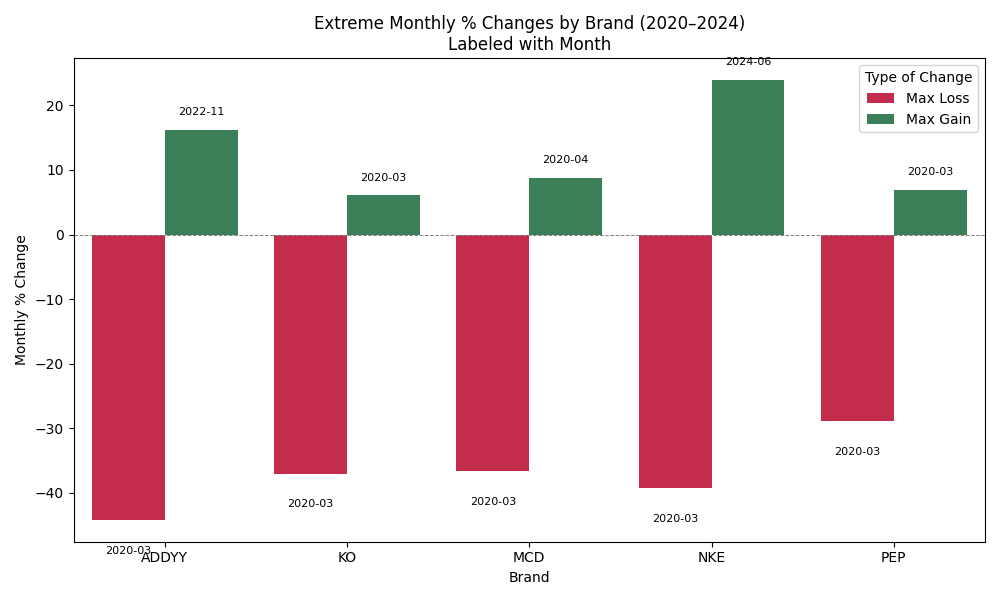
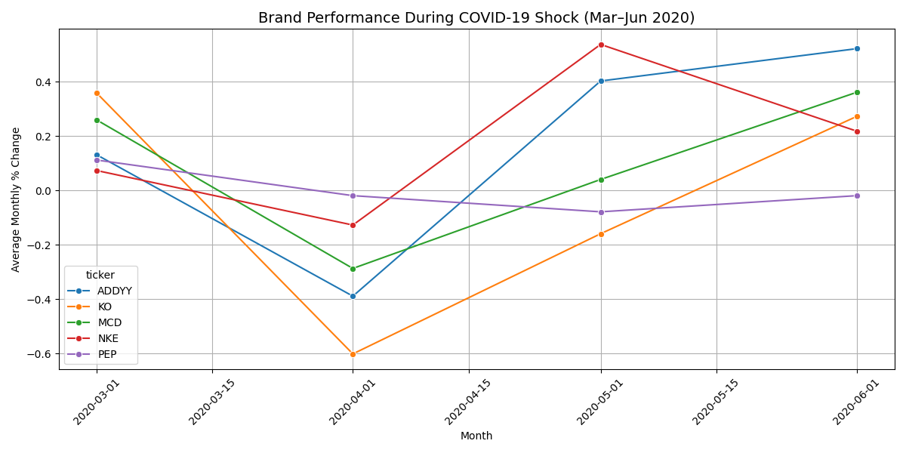
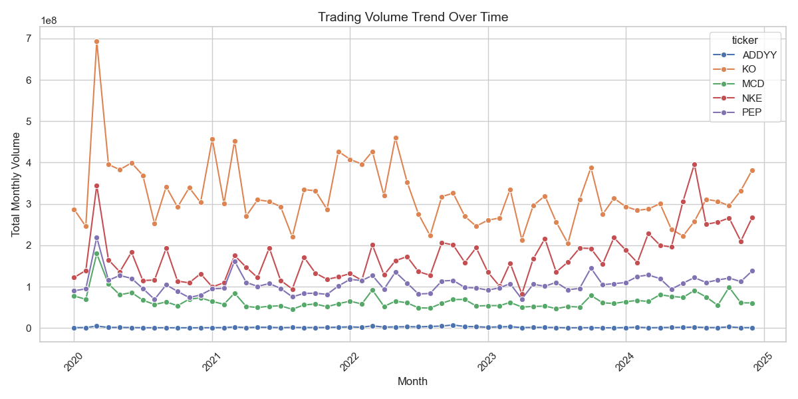

# Consumer Confidence Through the Lens of Brand Stock Performance: A SQL Time-Series Analysis
**SQL Data Analysis project by Emmanuel Ikhile**

***Objective:***

This project explores the stock performance of five globally recognized, consumer-facing brands (KO, PEP, NKE, ADDYY, MCD) over a five-year period (2020–2024). The goal is to use stock trends, volatility, and trading behavior as proxies for consumer trust, brand resilience, and investor confidence — especially during major economic events like COVID-19 and inflation surges.
By leveraging SQL for time-series analysis, the project uncovers:
- Patterns in monthly price changes
- Periods of extreme gains/losses
- Volatility and stability during sensitive periods (e.g., holidays, inflation)
- Long-term growth trends and brand ranking

***Tools & Data Sources***

- Data Source: Yahoo Finance via the yfinance Python package
- Database: PostgreSQL (hosted locally via pgAdmin)
- Analysis Tools: Python (for data collection), SQL (for querying and insights)

***Brands Analyzed:***
Coca-Cola (KO)
PepsiCo (PEP)
Nike (NKE)
Adidas (ADDYY)
McDonald’s (MCD)

## Summary of Business Questions

### Question 1: What was the monthly percentage change in closing prices for each brand from 2020 to 2024?
***Key Insight:***
- Using SQL, I calculated the month-over-month percentage change in closing stock prices for each brand (KO, PEP, NKE, ADDYY, MCD) over the 5-year period. This metric helps identify short-term shifts in investor sentiment, brand performance, and market reactions.
- The Data Shows that:
Brands like MCD and KO generally had more stable month-to-month changes, suggesting steady investor confidence.
Brands such as NKE and ADDYY showed more volatility, likely due to external factors like fashion trends, supply chain issues, or economic cycles.
Specific months (e.g., pandemic onset in March 2020, inflation spikes in 2022) show notable drops or surges in multiple brands — indicating systemic market events affecting consumer sentiment. 

### Question 2: Which brand had the highest average monthly return over the 5-year period (2020–2024)?
- ***Method:***
Calculated the average monthly percentage change in closing stock prices for each brand from January 2020 to December 2024 using SQL.
This used the monthly % change values derived from Question 1, which were already scaled as percentages.
- Results:
Brand	Avg. Monthly Return
ADDYY	7.00%
MCD	6.00%
KO	5.00%
NKE	5.00%
PEP	4.00%
- Insight:
Adidas (ADDYY) had the highest average monthly return, suggesting strong and steady investor confidence and possible international momentum.
McDonald’s (MCD) followed closely, reflecting brand resilience and trust even during volatile market conditions.
Beverage giants Coca-Cola (KO) and PepsiCo (PEP) showed modest growth, with PepsiCo trailing slightly.
- Business Takeaway:
Adidas emerged as the strongest performer in terms of average month-over-month growth, potentially reflecting increased global demand, brand relevance, or strategic wins over the 4-year window.

### Question 3: Which brand was most volatile month-to-month (2020–2024)?
- Results (Standard Deviation of Monthly % Change):
Brand	Volatility (Std Dev)
ADDYY	3.77
NKE	3.24
KO	2.00
MCD	1.96
PEP	1.72
(Rounded to 2 decimal places for reporting clarity)
- Insight:
Adidas (ADDYY) had the highest standard deviation in monthly returns, indicating it was the most volatile and subject to sharp fluctuations in investor sentiment or market events.
PepsiCo (PEP) was the most stable brand over the 5-year period, with the lowest volatility.
NKE (Nike) also exhibited considerable fluctuations, reinforcing its position as a more reactive or growth-sensitive brand.
- Takeaway:
Brands like Adidas and Nike may offer higher potential returns, but also carry more short-term risk, while brands like PepsiCo and McDonald’s deliver more consistent, lower-volatility performance — likely reflecting stronger market trust and defensive business models.

### Question 4: What was the cumulative return for each brand over the full period (2020–2024)?
- Results (Cumulative Return):
Brand	Cumulative Return (%)
ADDYY	328.09%
NKE	186.19%
MCD	156.08%
KO	121.77%
PEP	105.23%
- Insight:
Adidas (ADDYY) showed a staggering 328% cumulative return — outperforming all other brands by a wide margin. This suggests exceptional long-term market performance, possibly fueled by global expansion, brand innovation, or investor optimism.
Nike (NKE) and McDonald's (MCD) also posted strong gains, reflecting sustained brand strength and strategic consistency.
While Coca-Cola (KO) and PepsiCo (PEP) grew more modestly, their positive returns still indicate reliable market confidence and steady investor appeal.
- Takeaway:
Adidas has been the standout performer over this period in terms of cumulative return — signaling both strong brand equity and market responsiveness. This could position it as a leader in consumer trust and global growth strategy.

### Question 5: During which months did each brand experience its steepest gains or losses?
To identify the most extreme monthly stock movements (highest gain and steepest loss) for each brand between 2020 and 2024 — offering insight into market shocks and brand resilience.
- Results:
Brand	Max Gain	Month	Max Loss	Month
ADDYY	+16.24%	Nov 2022	-44.14%	Mar 2020
KO	+6.06%	Mar 2020	-36.99%	Mar 2020
MCD	+8.72%	Apr 2020	-36.56%	Mar 2020
NKE	+23.91%	Jun 2024	-39.18%	Mar 2020
PEP	+6.96%	Mar 2020	-28.82%	Mar 2020
- Insights:
March 2020 was the worst-performing month across all brands, reflecting the global stock market crash triggered by COVID-19.
Adidas (ADDYY) and Nike (NKE) had the most dramatic swings — with ADDYY’s -44.14% drop and NKE’s 23.91% recovery in June 2024 standing out.
Several brands like KO and PEP experienced both steep losses and partial rebounds within the same month — underscoring extreme volatility.
McDonald’s (MCD) bounced back quickly in April 2020, showing signs of early consumer recovery.
- Visualization:
The extreme gain/loss events were plotted in a grouped bar chart, with each bar labeled by month, making it easy to spot brand-specific crises or recovery surges. 

### Question 6 : COVID-19 Shock Impact (March–June 2020)
- Analysis Approach:
Filtered monthly percentage change data from March to June 2020.
Calculated average monthly % change for each brand.
Visualized the trend using a multi-line chart.
- Key Insights:
March 2020 Crash:
All five brands experienced their steepest monthly losses during March 2020.
Adidas (ADDYY) was hit the hardest with a -44.14% drop.
Nike (NKE), Coca-Cola (KO), McDonald’s (MCD), and Pepsi (PEP) also saw losses over -28%.
- April to June 2020 Recovery:
Most brands began recovering by April, showing positive average gains.
Recovery patterns varied — Adidas and McDonald's had stronger rebounds early, while Pepsi showed a steadier, modest climb.
Despite the severe hit in March, no brand experienced another major loss over the next 3 months.
- Overall Observation:
The chart clearly highlights the V-shaped recovery pattern for several brands.
The resilience of these global consumer brands suggests strong brand loyalty and investor confidence even in times of economic stress. 

### Question 7: Which brand had the most consistent performance during the holiday season (Nov–Dec)?
To determine consistency, you calculated the standard deviation of the monthly percentage change (monthly_pct_change) during November and December (holiday season) for each brand.
- Results:
Brand	Holiday Season Volatility (Std Dev)
MCD	1.11 (most consistent)
PEP	1.23
KO	1.44
NKE	1.88
ADDYY	3.43 (most volatile)
- Insight:
McDonald's (MCD) exhibited the most stable performance during the holiday season with the lowest volatility.
Adidas (ADDYY) was the most volatile brand during the same period, meaning its returns fluctuated the most.

### Question 8 Trading Volume Trend Summary (2020–2024)
 1. KO (Coca-Cola)
- Overall Trend: KO maintained the highest and most stable trading volume across the entire time frame.
- Peak Periods: March 2020 and March 2021 saw spikes, likely due to COVID-19-related market movements.
- Stability: KO shows low volatility, with volumes consistently ranging in the hundreds of millions monthly.
- Holiday Activity (Nov–Dec): Shows consistent strength in trading activity during holiday seasons each year.

 2. NKE (Nike)
- Overall Trend: NKE had a significantly rising trend, especially from mid-2023 to 2024.
- Peak Volume: June and July 2024 saw exceptionally high trading volumes, surpassing 300–390 million.
- Volatility: High volatility with periodic spikes (e.g., March 2020, March 2022, March 2024).
- Holiday Activity: Strong end-of-year volumes in Nov–Dec 2022 and 2023.

 3. PEP (PepsiCo)
- Overall Trend: Moderate, fairly stable growth.
- Peak Periods: March 2020, March 2021, and December 2024.
- Holiday Activity: Noticeable volume increases in Nov–Dec months, especially Dec 2024.

 4. MCD (McDonald's)
- Overall Trend: Lower trading volume than the top three brands but stable.
- Notable Spikes: March 2020 and October 2024 (reaching near 100 million).
- Consistency: MCD had small fluctuations with no major surges or drops.
- Holiday Activity: Slight uptick in Nov–Dec periods but not dramatic.

 5. ADDYY (Adidas)
- Overall Trend: By far the lowest trading volume among all brands.
- Peak: October 2022 showed the highest activity (~7.2 million).
- Volatility: Relatively steady with occasional jumps; volumes are in the thousands to low millions.
- Holiday Activity: No notable spikes during Nov–Dec.

 ***Insights***
 
KO is the most actively and consistently traded brand over time.
NKE shows a sharp upward trend, indicating growing investor interest.
PEP and MCD show moderate activity with stable investor engagement.
ADDYY has niche trading behavior, suggesting it’s less liquid or traded in different markets. 
 
### Question 9 - Performance Summary During High Inflation (2022)
In 2022, amidst global inflationary pressure, Coca-Cola (KO) demonstrated the strongest performance in terms of trading activity, recording a total trading volume of over 4 billion shares — more than double that of any other brand in the comparison.

- Trailing behind were:
Nike (NKE) with 1.93 billion,
PepsiCo (PEP) with 1.29 billion,
McDonald’s (MCD) at 741 million, and
Adidas (ADDYY) with a significantly lower volume of just 43 million.

This suggests that KO maintained the most consistent and robust investor interest during the high inflation months of 2022, potentially reflecting investor confidence in its resilience and consumer staples positioning.

### Question 10 Ranking Brands by Long-Term Growth and Volatility (2020–2024)
To identify the strongest overall performer, we assessed each brand's long-term growth (based on % change in average monthly trading volume from 2020 to 2023–2024) and volatility (standard deviation of their monthly trading volumes).

- Brand	Growth (%)	Volatility	Interpretation
NKE	+29.41%	61.14M	Strongest overall performer — highest growth and moderate volatility.
ADDYY	+15.29%	1.36M	Good growth with very low volatility, suggesting strong and stable investor interest.
PEP	+2.99%	23.57M	Minimal growth with moderate stability.
KO	-19.21%	79.16M	Declining trend and highest volatility — indicating inconsistent investor sentiment.
MCD	-21.65%	20.06M	Negative growth and moderate volatility — weakest long-term performance.
- Conclusion
Nike (NKE) leads with the strongest overall performance, combining the highest growth and moderate consistency.
Adidas (ADDYY) shows promising growth with remarkably low volatility, signaling investor confidence.
Pepsi (PEP) is steady but not growing significantly.
Coca-Cola (KO) and McDonald's (MCD) experienced significant volume declines, making them the least favorable in long-term performance.

### Final Thoughts
- This project offered a practical exploration of consumer confidence and market sentiment through the lens of stock performance. By leveraging SQL for time-series analysis, we extracted meaningful insights into brand stability, growth, and volatility across five major consumer-facing companies from 2020 to 2024.
-From identifying resilient performers during economic shocks like COVID-19 and inflation, to ranking brands by long-term strength, the analysis reinforces how financial data can reflect public trust and investor behavior. Overall, Nike and Adidas emerged as standout performers, while Coca-Cola and McDonald’s showed signs of investor caution in later years.
-This project highlights the power of combining real-world data with SQL analysis to make informed, data-driven business interpretations.

***CONTACT:*** [Email](mailto:emmaikhile34@gmail.com) [Linkedln](www.linkedin.com/in/emmanuel-ikhile-2436b0258)
